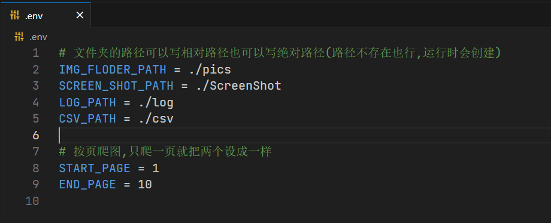
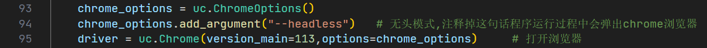

# konachan_crawler

​	**按页**爬取 [K站](https://konachan.net) 上的图片(原图保存)，~~_lsp_~~**老二次元**狂喜:tada::tada::tada:

---

## 0.环境需求

> - [python3.6+](https://github.com/ultrafunkamsterdam/undetected-chromedriver/blob/master/README.md)
> - Chrome 浏览器

打开控制台(cmd)，在当前python环境下输入**`pip install -r requirements.txt`**下载相关的库

---

## 1.如何运行

​	首先更改**.env**文件里的配置信息,确定爬的范围和文件保存路径

> - `IMG_FLODER_PATH`:所有从网站上下载的原图保存在这里
> - `ScreenShot`:每爬一页把这一页截图保存在的它的子文件夹(按当前运行时间命名)里
> - `LOG_PATH`:日志的输出路径
> - `CSV_PATH`:每张图片的具体信息(id,tags,file_url之类)保存在这里
> 

​	然后运行**Main.py**程序就可以了。如果是在控制台下,输入**`python Main.py`**运行程序。

---

## 2.(可能出现的)错误解决方法

> - 关掉代理(如果你~~_翻墙_~~用了魔法了的话)
>
> - 更新chrome浏览器至`108`版本以后,或者自行调整`93~95`行程序
>
> 	
> 	
> - [下载与自己浏览器对应版本的chromedriver](https://blog.csdn.net/zhoukeguai/article/details/113247342)

---

## 3.其它

- 遵守了[robots.txt](https://konachan.net/robots.txt)的内容限制
- 为避免对网站造成过大影响,程序中设置了一次运行最多可爬10页的限制(几百Mb,已经不小了)

